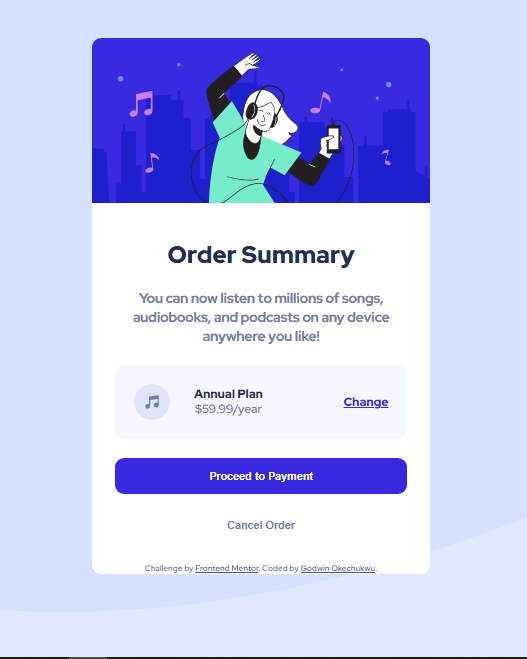

# Frontend Mentor - Order Summary Card solution

This is my solution to the [Order summary card challenge on Frontend Mentor](https://www.frontendmentor.io/challenges/qr-code-component-iux_sIO_H). Frontend Mentor challenges help you improve your coding skills by building realistic projects.

## Table of contents

- [Overview](#overview)
  - [Screenshot](#screenshot)
  - [Links](#links)
- [My process](#my-process)
  - [Built with](#built-with)
  - [What I learned](#what-i-learned)
  - [Continued development](#continued-development)
  - [Useful resources](#useful-resources)
- [Author](#author)
- [Acknowledgments](#acknowledgments)

## Overview

### Screenshot



### Links

- Solution URL: [GitHub](https://github.com/godwin-okechukwu/order-summary-component.git)
- Live Site URL: [Add live site URL here](https://your-live-site-url.com)

## My process

### Built with

- Semantic HTML5 markup
- CSS custom properties
- Flexbox

### What I learned

I learnt the idea behind using `* {box-sizing: border-box; margin: 0; padding: 0;}` in CSS styling. Furthermore, this challenge compelled me to learn Git and GitHub as well as Markdown, the lack of which had hindered my progress as a developer.

```css
* {
  margin: 0;
  padding: 0;
  box-sizing: border-box;
}
```

If you want more help with writing markdown, we'd recommend checking out [The Markdown Guide](https://www.markdownguide.org/) to learn more.

**Note: Delete this note and the content within this section and replace with your own learnings.**

### Continued development

I hope to come improve on the presentaion and funtionality of the QR-Code Component sometime as I improve my knowledge and skillbase.

### Useful resources

- [HTML CSS Tutorial Order Summary Component](https://www.freecodecamp.com) - This resource really helped me wrap my head around the CSS Box Model concept. I really liked this tutorial and will refer to it in subsequent projects.
- [Git & GitHub Crash Course](https://www.traversymedia.com) - Brad Traversy has always been an inspiration to me and many newbie developers. I'd recommend it to anyone still learning this concept.

## Author

- Frontend Mentor - [@GodwinOkechukwu](https://www.frontendmentor.io/profile/godwin-okechukwu)
- Twitter - [@GodwinOlewunne](https://www.twitter.com/godwinolewunne)
- GitHub - [@GodwinOkechukwu](https://github.com/godwin-okechukwu)

## Acknowledgments

A big thank you to Matt Studdert for setting up this amazing platform as it has shapened my approach and resolve to get into tech in a meaningful and structured way.I also want to thank Brad Traversy for putting out rich contents on his youtube channel, Traversy Media. And I thank the creators of FreeCodeCamp.
